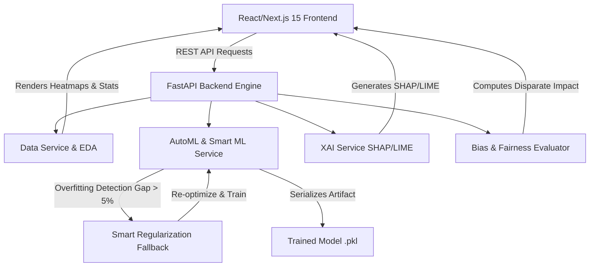

# InsightX AI 🚀
### *Explainable AI Platform — Making Machine Learning Interpretable, Fair, and Trustworthy*

InsightX AI is a comprehensive, production-grade Explainable AI (XAI) and MLOps platform designed to simplify the machine learning lifecycle. It offers automated model selection (AutoML), robust regularized model training to prevent overfitting, interactive model explanations (SHAP & LIME), fairness evaluations (Bias Analysis), exploratory data analysis (EDA), counterfactual reasoning (What-If analysis), and direct report exporting.

---

## 🌟 Core Features

### 🤖 1. Advanced ML & AutoML Engine
*   **Multi-Algorithm Support:** Train and compare state-of-the-art models including **XGBoost**, **LightGBM**, **Multi-Layer Perceptron (MLP) Neural Networks**, **Random Forest**, **Gradient Boosting**, **Linear/Logistic Regression**, and **Stacking Ensembles**.
*   **AutoML Execution:** Automatically explores hyperparameter spaces, evaluates performance metrics across 5-Fold Cross Validation (`K-Fold`/`StratifiedKFold`), and builds a Meta "Super Model" (`StackingClassifier`) by pooling predictions from top-tier algorithms.
*   **Task Versatility:** Supports both **Classification** (binary/multiclass) and **Regression** problems.

### 🧬 2. Enterprise Data Preprocessing (Zero Leakage Pipeline)
*   **Imbalanced Data Defense (SMOTE):** Automatically detects severe class imbalances and applies Synthetic Minority Over-sampling Technique (`imbalanced-learn`) to protect the model from majority-class bias.
*   **Target Encoding:** Replaces naive One-Hot Encoding with Target Encoding for high-cardinality categorical features, preventing feature-space bloat and preserving tree-model efficiency.
*   **MICE Imputation & Robust Scaling:** Intelligently predicts missing values using `IterativeImputer` (Multiple Imputation by Chained Equations) and normalizes distributions ignoring extreme outliers using `RobustScaler`. All transformations are strictly applied *post-split* to guarantee zero data leakage.

### 🛡️ 3. Smart Regularization & Anti-Overfitting Pipeline
*   **Automated Overfitting Detection:** Actively monitors the performance delta between training and test sets. If a gap exceeds **5%**, the platform triggers an automatic overfitting defense protocol.
*   **Dynamic Fallback Strategy:** Automatically switches to high-regularization parameter suites (e.g., increased `L1`/`L2` penalty, reduced max depth) and re-evaluates until a generalizable model is secured.

### 🔍 4. Explainable AI (XAI) Hub
*   **SHAP (SHapley Additive exPlanations):** Global feature importance charts and local force-like explanation outputs that quantify each feature's contribution to individual predictions.
*   **LIME (Local Interpretable Model-agnostic Explanations):** Explains black-box predictions locally by perturbing the input data and fitting an interpretable surrogate model.
*   **Interactive Visualizations:** Sleek charts mapping out exact numeric importances and model decision boundaries.

### 📊 5. Interactive Exploratory Data Analysis (EDA)
*   **Correlation Matrix Heatmaps:** Instantly understand linear relationships between attributes.
*   **Value Distributions:** Examine density and count distributions for both target variables and individual features.
*   **Data Health Audits:** Automatic missing-value assessments, target skewness indicators, and data type summaries.

### 🔮 6. Interactive "What-If" Analysis
*   **Sensitivity Testing:** Adjust individual feature values using real-time sliders and input fields to immediately witness how the trained model's prediction changes.
*   **Counterfactual Explorer:** Run simulations to find the minimum feature modification required to flip a classification prediction (e.g., from *Denied* to *Approved*).

### ⚖️ 7. Fairness & Bias Assessment
*   **Demographic Audits:** Analyze model predictions against protected attributes (e.g., age, gender, ethnicity) using fairness metrics like **Demographic Parity** and **Equalized Odds**.
*   **Disparate Impact & Selection Rate:** Quantify systemic bias to ensure ethical AI deployments.

### 📥 8. Model Exporting & Reporting
*   **Serialized Artifacts:** Download the fully trained ML model as a standardized Python `.joblib` file alongside its data preprocessors for immediate downstream deployment.
*   **Executive PDF/HTML Reports:** Export clean, well-formatted summaries of model performance, EDA visualizations, fairness metrics, and feature importances.

---

## 🏗️ System Architecture



---

## 📂 Project Structure

```text
InsightX/
├── frontend/                  # Next.js 15 + TypeScript + Vanilla CSS / Tailwind
│   ├── src/
│   │   ├── app/               # App Router pages (EDA, Bias, What-If, Export, etc.)
│   │   ├── components/        # UI dashboards, layouts, and data charts (Recharts)
│   │   ├── lib/               # API clients, store configurations, and helpers
│   │   └── types/             # TypeScript interfaces
│   └── public/                # Static assets & icons
│
├── backend/                   # Python FastAPI ML Engine
│   ├── app/
│   │   ├── main.py            # API entry point & CORS configuration
│   │   ├── config.py          # Environment settings and paths
│   │   ├── routes/            # Module-specific API routing
│   │   │   ├── data.py        # Upload, processing, & target selection
│   │   │   ├── automl.py      # Automated training pipelines
│   │   │   ├── eda.py         # Advanced stats & heatmaps
│   │   │   ├── whatif.py      # Counterfactual predictions
│   │   │   ├── bias.py        # Fairness auditing
│   │   │   └── export.py      # PDF/HTML reports & pickle serialization
│   │   ├── services/          # Core Business Logic
│   │   │   ├── ml_service.py  # Model training, prediction, & AutoML optimization
│   │   │   └── xai_service.py # SHAP & LIME computation algorithms
│   │   └── models/            # Pydantic schemas for data validation
│   ├── tests/                 # Comprehensive Pytest Suite
│   ├── uploads/               # Staged dataset cache (gitignored)
│   ├── trained_models/        # Saved model binaries (gitignored)
│   └── requirements.txt       # Python dependencies
└── README.md
```

---

## 🚀 Installation & Local Setup

### ⚙️ Prerequisites
*   **Python 3.9+** (Python 3.11 recommended)
*   **Node.js 18+** & **npm**
*   *For macOS/Linux (XGBoost/LightGBM support):* You may need OpenMP. On macOS, run `brew install libomp`.

---

### 🖥️ 1. Backend Setup

1.  Navigate to the backend directory:
    ```bash
    cd backend
    ```

2.  Create and activate a virtual environment:
    ```bash
    python -m venv venv
    source venv/bin/activate  # On Windows: venv\Scripts\activate
    ```

3.  Install dependencies:
    ```bash
    pip install -r requirements.txt
    ```

4.  Launch the FastAPI server:
    ```bash
    uvicorn app.main:app --reload --port 8000
    ```
    *The API will be available at `http://localhost:8000`. You can inspect interactive API documentation at `http://localhost:8000/docs`.*

---

### 🎨 2. Frontend Setup

1.  Navigate to the frontend directory:
    ```bash
    cd ../frontend
    ```

2.  Install packages:
    ```bash
    npm install
    ```

3.  Run the Next.js development server:
    ```bash
    npm run dev
    ```
    *The client application will start at `http://localhost:3000`.*

---

## 🧪 Running the Test Suite

The platform includes a robust automated testing framework containing unit and integration tests.

To run the test suite:
1.  Ensure your backend virtual environment is active.
2.  Navigate to the backend directory and run:
    ```bash
    cd backend
    pytest
    ```

This executes:
*   `test_unit_ml_service.py` - Validating algorithm training, regularization fallbacks, and prediction behavior.
*   `test_unit_xai_service.py` - Ensuring SHAP/LIME values generate cleanly for diverse datasets.
*   `test_integration_api.py` - Simulating request lifecycles (data upload -> target selection -> training -> XAI -> bias checks).

---

## 🛡️ Smart Regularization Mechanics (Overfitting Defense)

The platform integrates a custom **Smart Regularization Pipeline** inside `ml_service.py`. When a model is trained:
1.  A standard 80/20 train-test split is executed.
2.  The engine evaluates the performance metric (R² for Regression, Accuracy/F1 for Classification) on both splits.
3.  **Overfitting Check:**
    $$\text{Metric Gap} = \text{Train Score} - \text{Test Score}$$
4.  If $\text{Metric Gap} > 0.05$ (5%), the engine registers an overfitting event.
5.  **Fallback Activation:** The training pipeline terminates the current model configuration and launches a secondary training loop with **strict regularization**:
    *   **XGBoost / LightGBM:** Increases `reg_alpha` and `reg_lambda` to `5.0`, sets `max_depth` to `3` or `4` to prevent deep tree nodes, and sets sub-sampling fractions.
    *   **MLP Classifier/Regressor:** Elevates `alpha` (L2 penalty) to `0.01` or higher.
    *   **Random Forest / Decision Tree:** Caps `max_depth` at `5`, requires high `min_samples_split` and `min_samples_leaf`.
    *   **Linear / Logistic Models:** Activates Ridge/Lasso penalties with maximum constraints.
6.  The pipeline retrains and logs the mitigation, ensuring all deployed models remain highly generalizable.

---

## 📝 License

Distributed under the MIT License. See `LICENSE` for more information.
